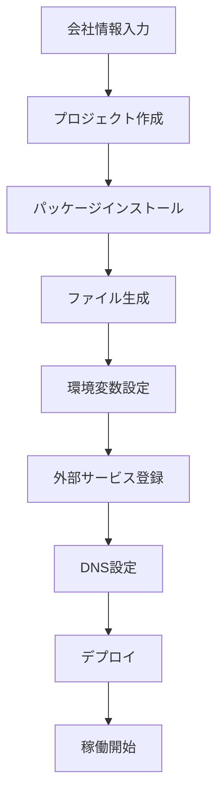

# MCP Company Website Builder Tool

## 概要
会社のホームページを完全自動で構築するMCPツールです。

## トリガーワード
以下のキーワードでツールが起動します：
- 新規会社のHP作成
- 会社のホームページを作る
- 企業サイト構築
- コーポレートサイト作成

## 含まれる機能

### 1. ウェブサイト基本機能
- Next.js 15.5.0 + TypeScript
- Tailwind CSS
- レスポンシブデザイン
- SEO最適化

### 2. 請求書・見積書システム
- PDF生成（日本語対応）
- A4サイズ1枚に最適化
- 編集機能
- ステータス管理
- データベース保存

### 3. メールシステム
- 独自ドメイン送信（Resend）
- メール転送受信（ImprovMX）
- 複数エイリアス対応
- SPF/DKIM/DMARC設定

### 4. データベース
- Turso（SQLite Cloud）
- 無料枠対応
- 自動バックアップ

### 5. 管理画面
- お問い合わせ管理
- 請求書管理
- 見積書管理
- パスワード保護

## 使用方法

### 自動実行（MCP経由）
```
ユーザー: 新規会社のHP作成をお願いします
AI: 会社情報を教えてください
ユーザー: 会社名は〇〇株式会社で...
AI: [自動的に全システムを構築]
```

### 手動実行
```bash
# スクリプトを実行
chmod +x create-company-website.sh
./create-company-website.sh

# 対話形式で情報入力
会社名: 株式会社サンプル
英語名: Sample Inc
業種: ITコンサルティング
住所: 東京都港区...
ドメイン: sample.com
```

## カスタマイズ可能項目

### 会社情報
- 会社名（日本語/英語）
- 住所
- 業種
- サービス内容

### デザイン
- カラースキーム
- ロゴ
- フォント
- レイアウト

### 機能
- ページ構成
- フォーム項目
- メールテンプレート
- PDF デザイン

## 必要な外部サービス

### 無料枠で運用可能
1. **Vercel** - ホスティング
2. **Turso** - データベース（9GB無料）
3. **Resend** - メール送信（3,000通/月無料）
4. **ImprovMX** - メール受信（無料）
5. **GitHub** - ソースコード管理

## セットアップフロー



## ファイル構成

```
company-website/
├── src/
│   ├── app/
│   │   ├── api/
│   │   │   ├── contact/     # お問い合わせAPI
│   │   │   ├── invoice/     # 請求書API
│   │   │   ├── estimate/    # 見積書API
│   │   │   └── email/       # メールAPI
│   │   ├── admin/
│   │   │   ├── contacts/    # お問い合わせ管理
│   │   │   ├── invoices/    # 請求書管理
│   │   │   └── estimates/   # 見積書管理
│   │   └── page.tsx         # トップページ
│   ├── components/
│   │   ├── Header.tsx       # ヘッダー
│   │   ├── Hero.tsx         # ヒーローセクション
│   │   ├── Services.tsx     # サービス紹介
│   │   ├── About.tsx        # 会社概要
│   │   ├── Contact.tsx      # お問い合わせ
│   │   └── Footer.tsx       # フッター
│   └── lib/
│       ├── db.ts            # データベース
│       ├── email.ts         # メール送信
│       └── pdfGenerator.tsx # PDF生成
├── public/                  # 静的ファイル
├── .env.local              # 環境変数
├── package.json            # 依存関係
└── README.md               # ドキュメント
```

## コマンド一覧

```bash
# 開発環境起動
npm run dev

# ビルド
npm run build

# 本番環境起動
npm start

# データベース初期化
npm run db:init

# デプロイ
npm run deploy

# メールテスト
npm run test:email
```

## トラブルシューティング

### よくある問題

1. **メールが届かない**
   - SPF/DKIM/DMARCレコードを確認
   - Resend APIキーを確認
   - スパムフォルダを確認

2. **PDFが文字化けする**
   - 日本語フォントが読み込まれているか確認
   - React PDFの設定を確認

3. **データベース接続エラー**
   - Tursoの認証情報を確認
   - ネットワーク接続を確認

4. **デプロイエラー**
   - 環境変数が設定されているか確認
   - package.jsonの依存関係を確認

## サポート

問題が発生した場合：
1. このドキュメントを確認
2. エラーログを確認
3. 環境変数を再確認
4. 外部サービスのステータスを確認

## ライセンス

MIT License - 自由に使用・改変可能

## 作成者

Kotaro Kashiwai

---

## MCPツール登録方法

1. このツールをMCPに登録
2. トリガーワード設定
3. 自動実行スクリプト連携
4. テンプレートファイル配置

これで「新規会社のHP作成」と言うだけで、全システムが自動構築されます。